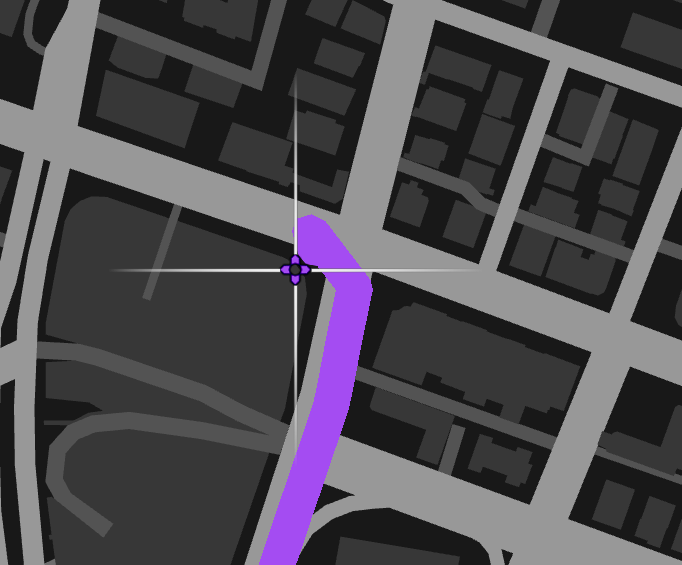
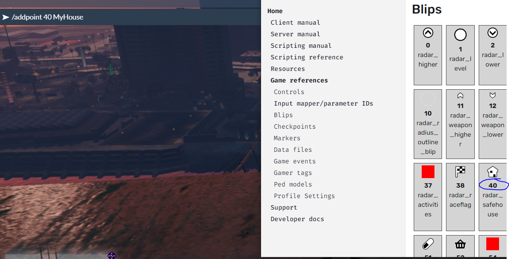
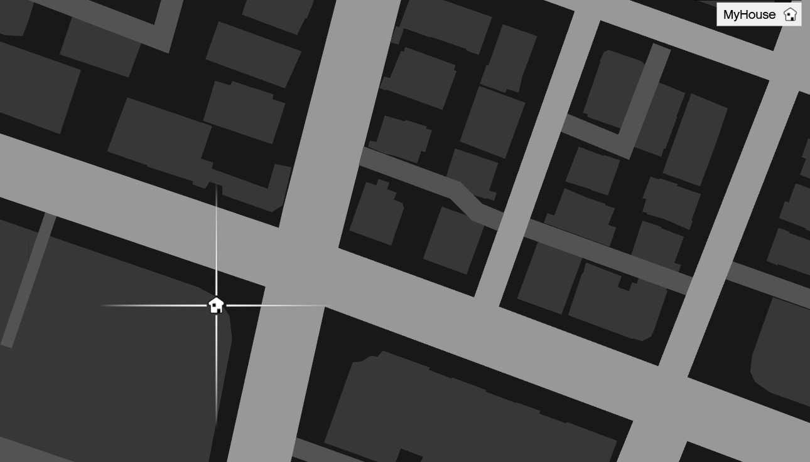

# hackee-playerpoint
 Allows players to set their own points of interest. `blipId` can be found [here](https://docs.fivem.net/docs/game-references/blips/) and `blipName` can be whatever you want. This is good if there are hidden locations on your map that players may want to remember.
 
 
 ```
 /addpoint <blipId> <blipName>
 /removepoint <blipName>
 ```
 

# Step 1: add waypoint


# Step 2: enter commmand

Note: I use [this site for info.](https://docs.fivem.net/docs/game-references/blips/)

# Step 3: profit ($$$)

