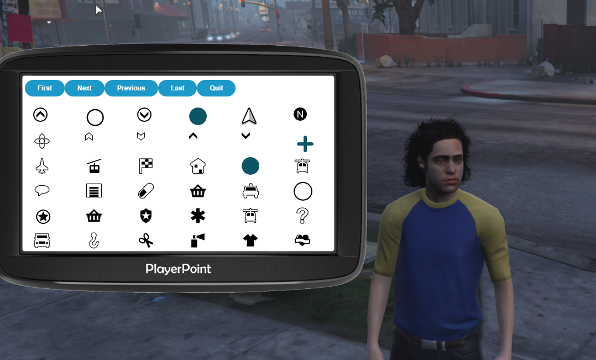

# hackee-playerpoint
 Allows players to set their own points of interest. `blipId` can be found [here](https://docs.fivem.net/docs/game-references/blips/) and `blipName` can be whatever you want. This is good if there are hidden locations on your map that players may want to remember.
 
 # Method 1: command
 ## Step 1: add waypoint, then type
 ```
 /addpoint <blipId> <blipName>
 or
 /removepoint <blipName>
 ```
# Method 2: UI
## Step 1: add waypoint


## Step 2: open UI + select blip

Note: default keybind is `b`

## Step 3: give name


## Step 4: profit $$$

